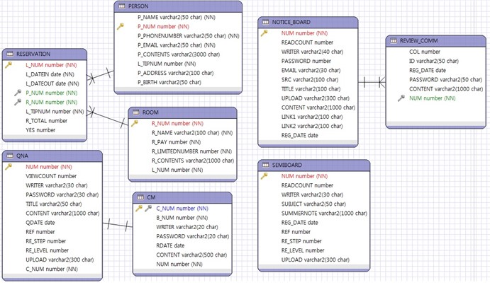
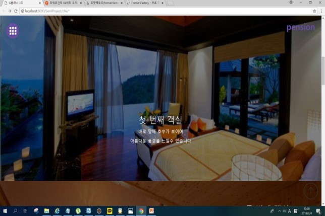
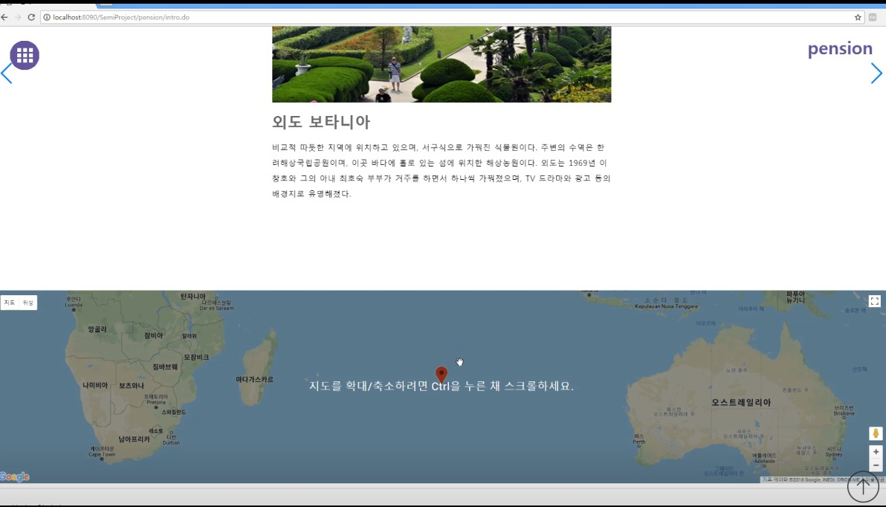
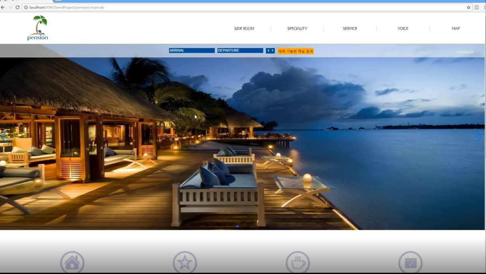
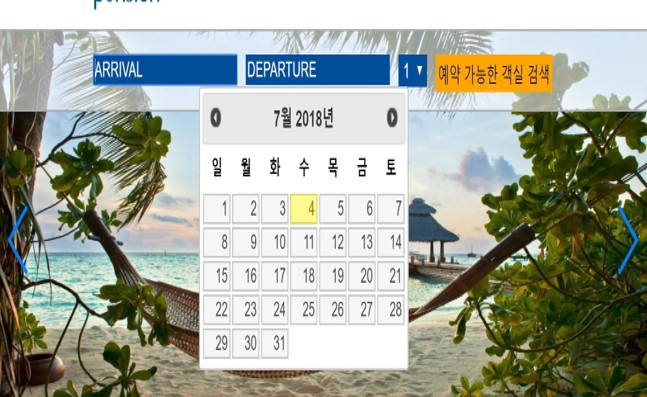
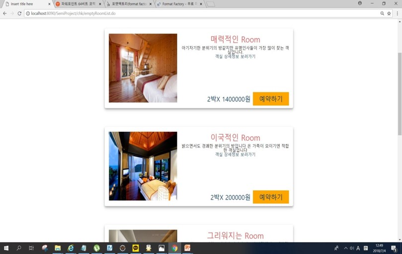

# 개발환경
* IDE : ECLIPSE
* Language : JAVA
* DBMS : ORACLE 10g
* SERVER : Apache-tomcat-8.5.31

# 개발목표
* 직관적이고 편안한 UI제공
* 사용자 중심의 편리한 예약 시스템
* 클라이언트를 돋보이게 해줄 웹 구현

# 맡은 역할
JAVA Script/AJAX/CSS/JSP를 활용한 메인구성과 예약관리 구성

- 인트로 및 메인구현  :  펜션 정보와 방 정보를 확인할 수 있게 구현
- 예약 날짜 구현 : 방을 예약할 경우 날짜를 이용하여 방을 불러올 수 있게 구현

# ER-Diagram

# 예시 이미지

